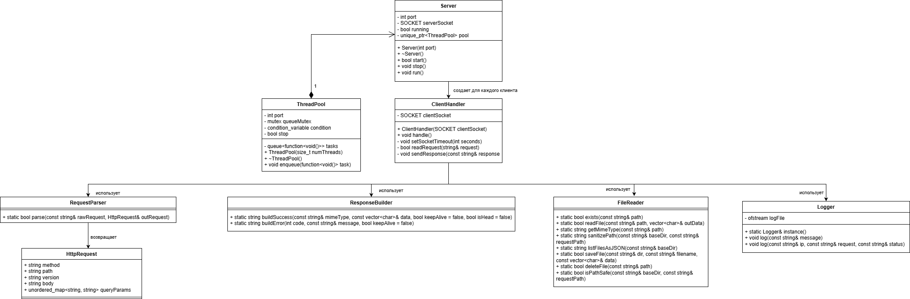

# 🚀 C++ HTTP Server

Многопоточный HTTP/1.1 сервер на чистом C++ (WinSock2) с поддержкой статических файлов, многопоточности, keep-alive, файлового API (загрузка, удаление, список) и веб-интерфейсом для управления.

## 📌 Основные возможности

- **HTTP/1.1** – обработка GET, HEAD, POST, DELETE запросов.
- **Статические файлы** – отдача HTML, CSS, JS, JSON, изображений из папки `www/`.
- **Keep‑Alive** – постоянные соединения (таймаут 5 с, до 100 запросов на сокет).
- **Многопоточность** – пул потоков (по умолчанию 4) для параллельной обработки клиентов.
- **API файлового менеджера**:
  - `GET /files` – список всех файлов в `www` (JSON).
  - `POST /upload` – загрузка файла в `www/uploads/`.
  - `DELETE /delete?file=path` – удаление файла (только внутри `www`).
- **Веб-интерфейс** – три вкладки: список и удаление файлов, примеры `curl`, инспектор GET/HEAD.
- **Логирование** – все запросы с кодами ответа пишутся в `server.log` и консоль.
- **Защита** – санитизация путей, запрет `..`, удаление только из `uploads/`.

## 🛠️ Технологии

- C++17 (или C++14 с адаптацией)
- WinSock2 (Windows Sockets)
- `std::thread`, `std::mutex`, `std::condition_variable` – пул потоков
- `std::filesystem` (C++17) – работа с файловой системой
- HTML/CSS/JS – фронтенд (без фреймворков)

## 📂 Структура проекта
```text
http_server/
├── main.cpp # точка входа, запуск сервера
├── Server.h / .cpp # создание сокета, accept, пул потоков
├── ClientHandler.h / .cpp # обработка одного клиента (keep-alive, разбор запросов)
├── RequestParser.h / .cpp # парсинг HTTP-запроса (метод, путь, параметры, тело)
├── ResponseBuilder.h / .cpp# формирование HTTP-ответа (200, 404, 400, 403, 500)
├── FileReader.h / .cpp # чтение файлов, MIME-типы, безопасность пути, API файлов
├── Logger.h / .cpp # логгирование в файл и консоль (потокобезопасный)
├── ThreadPool.h / .cpp # пул потоков (фиксированное количество)
├── www/ # корневая директория сайта
│ ├── index.html
│ ├── style.css
│ ├── script.js
│ ├── uploads/ # сюда сохраняются загруженные файлы
│ ├── (другие статические файлы)
└── server.log # создаётся автоматически
```



## 🔧 Сборка и запуск (Visual Studio)

1. Откройте проект в Visual Studio (2017+).
2. Установите **C++17**:
   - Проект → Свойства → C/C++ → Язык → Стандарт языка C++ → **ISO C++17 (/std:c++17)**.
3. Добавьте библиотеку `ws2_32.lib` (если не подключена через `#pragma comment`):
   - Компоновщик → Ввод → Дополнительные зависимости → `ws2_32.lib`.
4. Скомпилируйте (Ctrl+Shift+B).
5. Запустите (Ctrl+F5). В консоли появится:
```bash
HTTP Server starting...
Server started on port: 8080
Server will run on http://localhost:8080
```

6. Откройте браузер по адресу `http://localhost:8080`.

> **Примечание:** папка `www` должна находиться в рабочей директории исполняемого файла (обычно `Debug/` или `Release/`). Либо скопируйте её туда вручную.

## 📡 Примеры использования API

Все примеры выполняются в командной строке (curl).

### 1. Получить список файлов
```bash
curl http://localhost:8080/files
```
Ответ: JSON-массив `[{"name":"index.html","size":1234}, ...]`

2. Загрузить текстовый файл
```bash
curl -X POST -d "Hello world" http://localhost:8080/upload
```
Ответ: `{"status":"ok","file":"upload_1734567890.dat"}`

3. Загрузить бинарный файл
```bash
curl --data-binary "@myphoto.jpg" http://localhost:8080/upload
```

4. Удалить файл
```bash
curl -X DELETE "http://localhost:8080/delete?file=uploads/upload_1734567890.dat"
```
Ответ: `{"status":"deleted","file":"uploads/upload_1734567890.dat"}`

Важно: удалять можно только файлы внутри папки uploads/. Остальные файлы защищены от удаления через API.

5. Инспектор запросов (GET / HEAD)
Через веб-интерфейс: вкладка Инспектор – введите путь (например, `/style.css`) и выберите метод GET или HEAD.

## Тестирование keep-alive и многопоточности
### Keep-alive
Используйте `curl` с флагом `--keepalive`:

```bash
curl -v --keepalive http://localhost:8080/
```
В ответе будет `Connection: keep-alive`, а после нескольких запросов соединение останется открытым.

### Многопоточность
В веб-интерфейсе перейдите на вкладку Инспектор и нажмите кнопку "Запустить 8 одновременных GET" – все запросы выполнятся параллельно, общее время будет равно времени самого долгого запроса (доказывает работу пула потоков).

## Логирование
Лог-файл `server.log` автоматически создаётся в корневой папке сервера. Пример записи:
```text
2025-06-01 14:35:12 - Server started on port 8080
2025-06-01 14:35:22 - Client connected
2025-06-01 14:35:22 - 200 /index.html
2025-06-01 14:35:22 - 200 /style.css
2025-06-01 14:35:23 - 404 /favicon.ico
```

## Конфигурация
В `ClientHandler.cpp` можно изменить:
`MAX_REQUESTS` – максимальное количество запросов на одно keep-alive соединение (100).
`TIMEOUT_SECONDS` – таймаут ожидания следующего запроса (5 с).

В `Server.cpp` в конструкторе:
```cpp
pool = std::make_unique<ThreadPool>(4); // число потоков
```

Порт сервера задаётся в `main.cpp`:
```cpp
Server server(8080);
```

## Возможные ошибки и решения
Ошибка                |  Причина                      | Решение
----------------------|-------------------------------|-----------------------------------------------------------------------------------
`WSAStartup failed`     |	Не инициализирован Winsock    |	Убедитесь, что вызывается WSAStartup в `Server::start()`
`bind failed: 10048`    |	Порт уже занят	              | Закройте другие программы, использующие порт 8080, или измените порт
`404 /somefile`	      | Файл не найден	              | Проверьте, что файл существует в папке www и имя указано правильно
`400 Bad Request`	      | Некорректный HTTP-запрос      |	Проверьте, что вы отправляете валидный запрос (например, через `curl`)
`DELETE возвращает 404` |	Параметр `file` не декодирован  |	Браузер кодирует `/` как `%2F` – в коде сервера нужно декодировать URL (см. `urlDecode`)


## Архитектура
`main` – создаёт `Server`, запускает его, ждёт нажатия Enter для остановки.
`Server` – создаёт сокет, `bind`, `listen`, в цикле `accept` передаёт сокеты в `ThreadPool`.
`ClientHandler` – для каждого сокета: цикл keep-alive, вызов `readRequest`, парсинг, выбор маршрута (API или статика), отправка ответа.
`RequestParser` – разбирает первую строку (метод, путь, версию), извлекает параметры `?key=val` и тело запроса.
`ResponseBuilder` – собирает HTTP-ответ: статус, заголовки, тело (или только заголовки для HEAD).
`FileReader` – безопасное чтение файлов, MIME-типы, операции с файлами (список, сохранение, удаление, проверка безопасности).